# brio-catering-PP1

Brio Catering is a fictional catering company based in Dublin Ireland that provides luxury catering services around the country. Brio Catering caters to a variety of different events such as corporate events, weddings, and social gatherings. The webiste has been designed with our target customers in mind. As such we have created a website that describes the services and menu options in a clear and easy to follow manner. The website introduces the user to what Brio Catering is, the events Brio regularly cater for and the food/beverages options that are available to them. The website has been designed to ensure a responsive design and layout across different devices. 

View the live website here: [Brio Catering](https://moranjohn-95.github.io/brio-catering/index.html)

## Contents 

- [User Experience](#user-experience)
  - [User Story's](#user-stories)
  - [Business Owner Goals](#business-owner-goals)

- [Design](#design)
  - [Color Scheme](#color-scheme)
  - [Typography](#typography)
  - [Imagery](#imagery)
  - [Wireframes](#wireframes)
    - [Mobile](#mobile)
    - [Tablet](#tablet)
    - [Laptop & Larger Screen](#Laptop)
  
- [Features](#features)
  - [General Features](#general-features)
  - [Future Ideas/Potential Implementations](#future-ideas)
  - [Accessability](#accesability)

- [Technoligies Used](#technoligies-used)
  - [Languages Used](#languages-used) 
  - [Libraries & Programmes Used](#libraries-used)

- [Testing](#testing)
  - [W3C validator](#w3c-validator)
  - [Lighthouse](#lighthouse)
  - [Manual Testing](#lighthouse)
  - [Solved Bugs](#solved-bugs) 
 
 - [Deployment](#deployment)
  - [How to Deploy](#how-to-deploy)
  - [Local Deployment](#local-deployment)
    - [How to Fork](#how-to-fork)
    - [How to Clone](#how-to-clone)

- [Credits](#credits) 
  - [Content References](#content-references)
  - [Media References](#media-references)
  - [Acknowledgements](#acknowledgements) 

 ## User Experience (UX)
 
  ### User Story's 
   View User Story's here: [Brio Catering User Story's](https://github.com/users/moranjohn-95/projects/8)

  User story's were created in order to highlight the essential reqirmenrts that a potential customer using the website would be looking for. 
  
  - **Navigation - Ease of use** - This was a must-have non-negotiable as any website should be easy to navigate before anything else. 
  Of course for a catering company this was particularly important as to avoid any confusion or frustration fro potential customers. 

  - **Booking form** - Potential customers need to be able to book the catering service and this needed to be displayed in a way that was A. easy to find/use, B. featured all the necesary field inputs as to recieve the required information for the booking. This was also a must-have.

  - **Clear Pricing Structre** - This was an important factor when designing the website as potential customers definitely needed menus to be priced
  clearly in order to avoid confusion and see which menu was most suited to their budget. This was seen as a should-have.

  - **Menu's displayed on homepage** - Potential customers needed to be able to find information regarding menus quickly and while initially the plan
  was to have full menus on the homepage, it was felt this would overwhelm the user with information overload and a UX standpoint. As such the menu section featured smaller introductory menu cards that linked to fully listed menus. Both deaturing key pricing information, this was seen as a should have. 

  - **Services / Events** - Potential customers needed to be fully aware of what services were provided i.e what events Brio typically provided
  servcies to. this was seen as a should-have and was delivered on by providing a services section on the homepage.

  -  **404 page** - Users of the website needed to be notified when a page wasnt loading or where there was a broken link. This was seen as a could have.

  - **About Us Page/Testimonials/Careers Page** - ALL of these User Story's were seen as wont-haves. While they were initial ideas, ultimatley the decision to leave them out was made. These will all be potentially added features in the future as to futher improve UX.

 ### Business Owner Goals
  From the perspective of the fictional owner of Brio Catering, there were also some requirments relating to UX. 

  - **Portray a luxury service** - Ensure Brio Catering is portrayed as a luxury service throught the user expereince. 

  - **Contact/booking forms** - Ensure forms on website are developed/designed in a way that allows for maximum information to be received 
  reagrding query/booking. 

## Design

From a design standpoint it was very important to ensure any design-featues emphasised the luxury charecter of Brio Catering. 

### Color Scheme

Initial color pallete created on: [Coolers](https://coolors.co/)

The above HEX color scheme is used throughout the website. These colours were specially chosen in order to portray the sybmols of luxury, elegance and class. The colors are used throught the website in a consistent fashion with #3A3A3A being used for the header and footer background to provide contrast. #FBF9F7 provided a slightly stronger background for the main content sections as opposed to a lighter white color. #8FA18C was used for headings and more important stand out details like menu buttons. Finally #BCB46D was used for call to action buttons
like "book now" in order to stand out from all other colors.this ecru/gold color also signfies  a feeliing of luxury and elegance, a key attribute to be linked with Brio Catering.

### Typography 

[Google  fonts](https://fonts.google.com/) along with some primary research of font pairings were used to decide 2 primary fonts. Playfair-Display was used for headings and montserrat was used for more general content. In order to empahisis the feel of luxury and elegance, it was felt these fonts ticked all the boxes. Backup fonts of serif anf sans-serif were added to ensure a default font was used across a variety of browsers and devices. 

### Imagery 

[Pexels](https://www.pexels.com/) was used for images. All images were carefully selected to ensure they matched the overall design of the webiste and to ensure they were a fit with the content being used. All images responded well across all devices and browsers. 

### Wireframes 
Wireframes were created in order to get a better picture of what the webiste might look like. Wireframes were created for mobile, tablet and larger screens in order to get a good idea of responsivenes and what might work on different screen sizes.

#### Mobile 
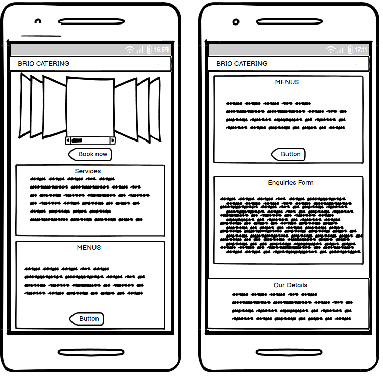

The above wireframe was created with ease of use and navigation in mind. Mobile phones are smaller and it can be harder to fit in or make content
look as appealing. The top section represents a carousel of images which was deisgned with freeing up space in mind. This is displayed with 3 static images in larger screens as to then use the free space better.

#### Tablet 
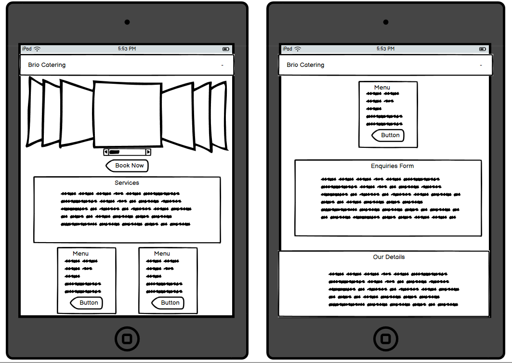

The above wireframe was created with ease of use and navigation in mind, being on tabelet there is more screen space on offer. With this in mind,
there was some light adjusmtents. The carousel is still being used, however the menu section has been changed in order to use the space better. The nav bar is still featured in the collapsed version. 

### Laptop & Larger Screens
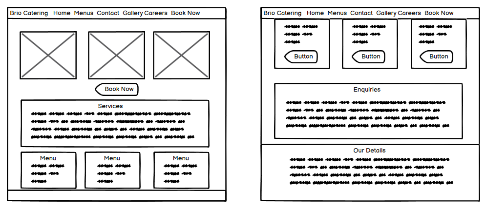

The above wireframe for laptop was designed slighlty different as to make the most out of the larger screen space available and to improve UX. 3 static images were preffered over the carousel and the menus were displayed as 3 in a line. A full nav bar was also preffered, although certain pages included in the wireframe were not used in the final design. 

## Features 
  
### General Features
This section will look more at the generic features that do not vary all that much per device screen size.

#### 404 Page
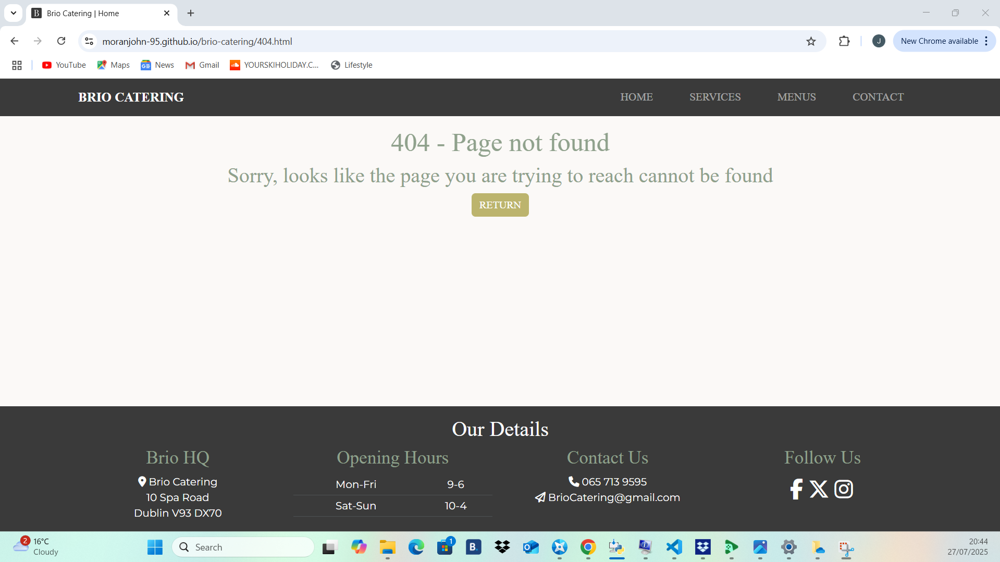
Added to ensure users will know if a page is not working and to show them a way of returning to the homepage.

#### Booking page
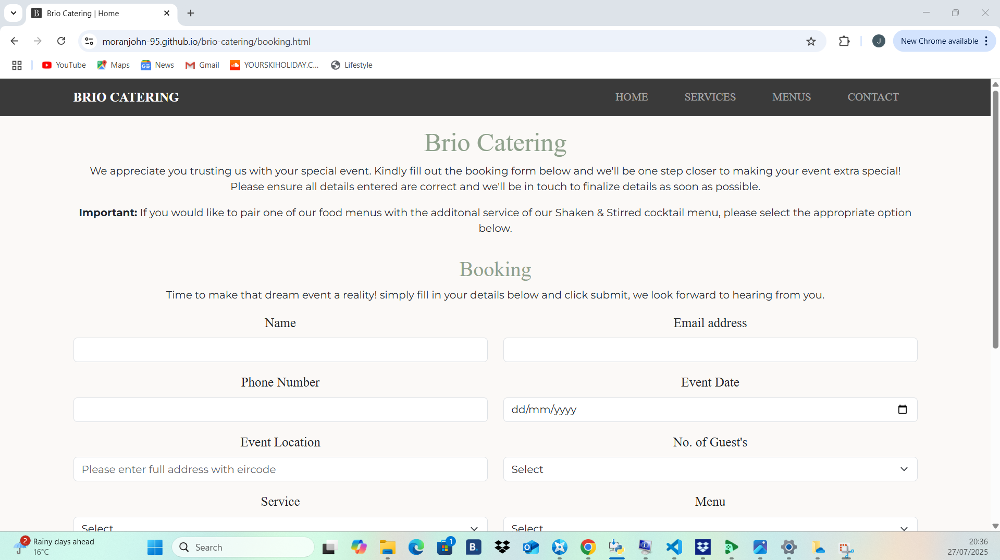
The above image showcases the booking page. all input fields are rquired and form does not let you submit without this.

#### Menu page
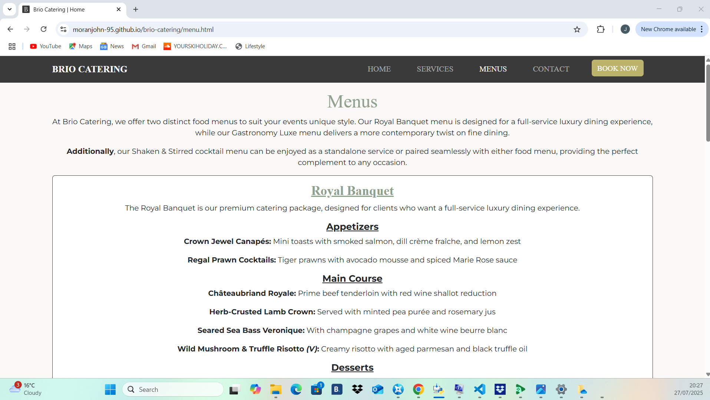
This was added as a seperate page as it was needed due to the large volume of content. Menu names and food options were generated  by ChatGPT. Each menu also contains a book now button as a call to action. 

#### Success Pages 
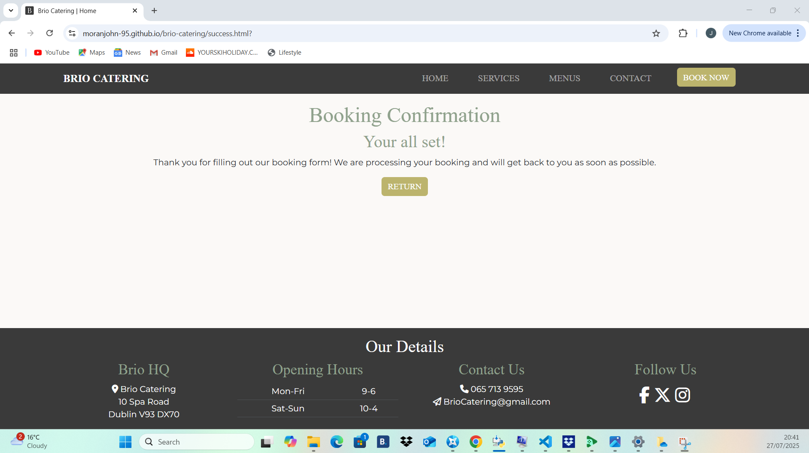
Two pages were added to ensure both the booking form and enquiry form would intitate a response to the user. 

### Mobile (Iphone 11)
The navigaton bar was an important feature to get right as it needed to be responsive across different screen sizes. 

#### Navigation bar
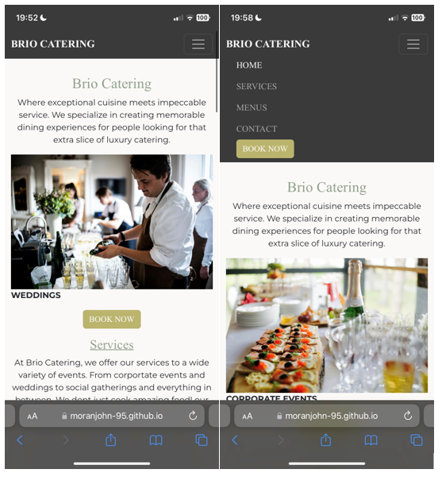

The above image showcases the navigation bar on mobile. dropdown menu appears when clicked on with a list of linked sections and pages. 

#### Carousel 
What is also noticable here is the two different Carousel images that appear. Arrows from the Carousel were removed to improve aesthetic of the website. The Carousel allowed for the inclusion of multiple images without taking up too much space on the smaller screen. 

#### Menus

In the above screenshot is the menu section of the homepage on mobile. These were created using bootstrap cards with css styling to create the round images. The 3 menus feature their own unique pricing. However the regualr color themes run through out with buttons providing the options to see more. These buttons link to the specific full menu displayed on the menus page. 

#### Enquiry Form

In the above image the enquiries form can be seen. This was again made using bootstrap forms with some additional css styling. All input fields work and once the form is submitted, it takes you to a page confirming your entry was sent successfully.
 
#### Footer
 

In the above image the footer area of the homepage can be seen on mobile. The layput here was changed using the bootstrap grid system. 

### Tablet 

#### Navigation bar

The above image showcases the navigation bar on tablet. dropdown menu appears and works the same way as on mobile described above. 

#### Carousel 
Carousel Appears and works the same way as it does on mobile, as can be seen in the above image. 

#### Menus

The layput here is slightly different to mobile in order to use up the space provided on a slighlty larger screen. The bootstrap grid system was used here in order to change the layout of the columns. 2 menus appear on the first row, with the third menu centered below.  

#### Enquiry Form

The enquiries form can be seen via tablet in the above image. Again, the boostrap grid system was used to change the layout of the columns and improve UX. 
 
#### Footer
In the above image the footer area of the homepage can be seen tablet. All other contact details are visible here. 

### Laptops & Larger Screens

#### Navigation bar

The above image showcases the navigation bar on a laptop. The dropown menu is no longer a required feature as the navigation bar features all the links and pages.  

#### Carousel 
In the above image it can be seen that the carousel is no longer being used. 3 static images now appear and this layout works better with regards to responsivenss. This was achevied by writing an additional section of code that was applied to larger screens only. 

#### Menus
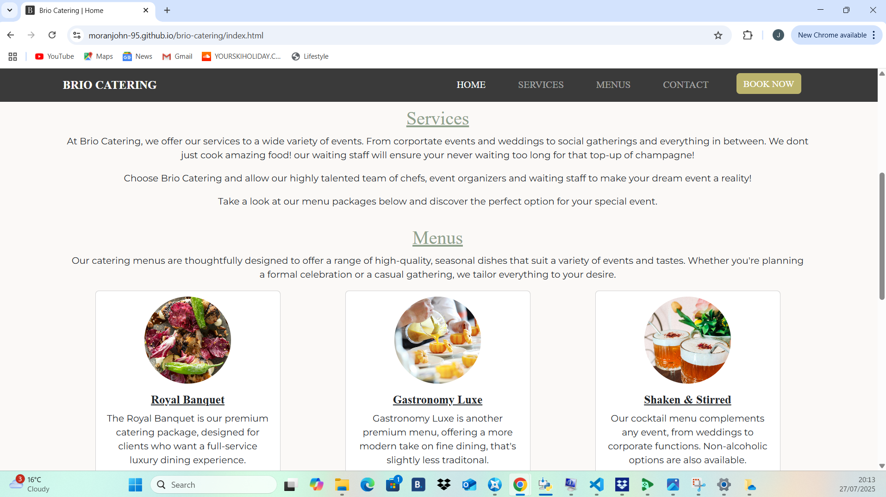

The layout here is slightly different to tablet in order to use up the space provided on a larger screen. The bootstrap grid system was used here in order to change the layout of the columns. 3 menus now appear on the one row.   

#### Enquiry Form
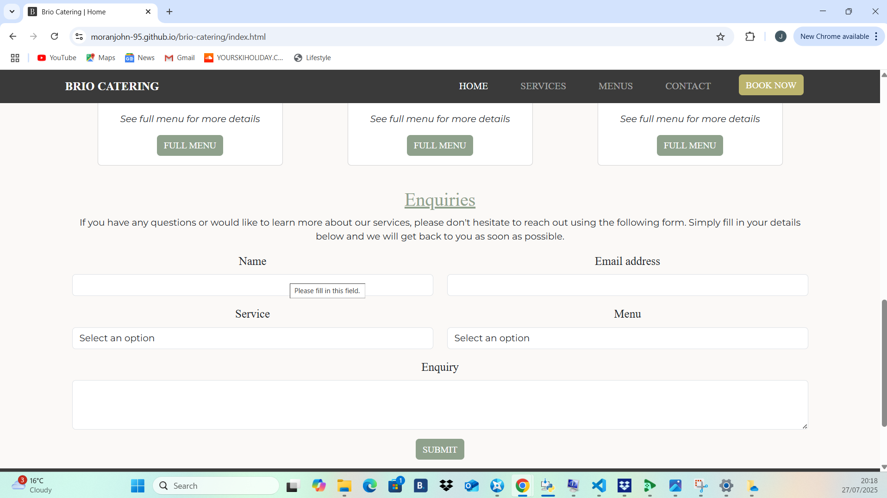

The enquiries form can be seen via laptop in the above image. Again, the boostrap grid system was used to change the layout. 
 
#### Footer
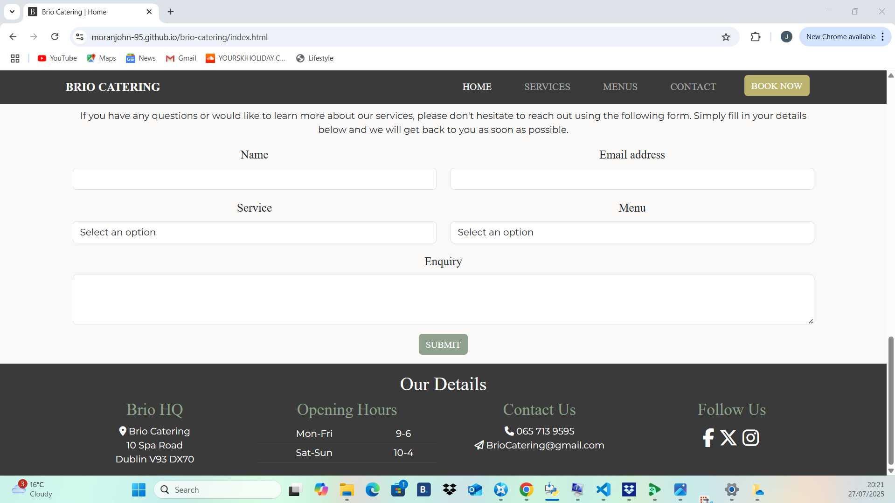

In the above image the footer area of the homepage can be seen on laptop. the bootsrap grid system was used again to change the layour futher.

## Future Ideas 
There are a number of ideas that can be implemented in the future. Looking at the User Story's there are a number of options. 

 - Testimonials - these can be added to the website to encourage a level of trustworthiness. 

 - Careers page - this page could potentially lead for the hiring of talented staff members further enhancing our overall offering. 

## Accessability 
I 

